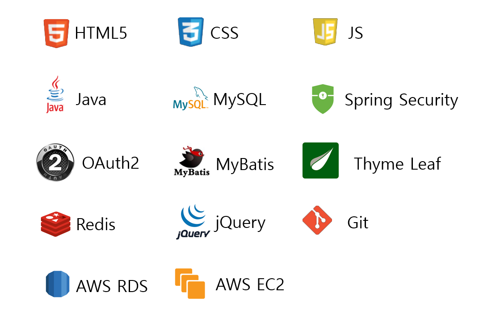

# 프랜차이즈 정보들과 커뮤니티 - Fran’s

## 프로젝트 개요

Fran's는 프랜차이즈 창업 정보를 제공하고, 지역 및 분야별 커뮤니티를 통해 상권 정보를 공유하는 서비스입니다.

### 진행 기간

- 2024년 7월 1일 → 2024년 7월 16일

### 인원
- 정상필, 유지명, 이지훈, 이환희
### 프로젝트 기여도 및 역할

- **정상필 (팀장)**:
    - 프로젝트 주제 및 서비스 주요 기능 관련 아이디어 기획
    - 회의 리드 (의견 취합, 일정 조율 등)
    - 유저 관리(로그인, 회원가입, 마이페이지) 개발
    - AWS EC2와 AWS RDS를 이용한 배포
    
    > 팀장으로서의 역할:
    > 
    > - 프로젝트 주제를 정하고, 회의를 주도하며 팀원들이 적극적으로 참여할 수 있도록 회의 일정을 조율하고 효율적인 회의 진행을 위해 안건을 정리했습니다.

### 핵심기능

🔒**회원 가입을 통한 커뮤니티 이용** 

**📖프랜차이즈의 카테고리 별 창업 정보 검색**

**🔎지역 검색 및 선택을 통한 근처 상권 검색**

### 📖노션

[노션](https://www.notion.so/Team-Project-Template-4f0be32c156e40f1baaa1dff3ab6e07d?pvs=4)

## 🛠️ 개발 환경

## ↔️ ERD

### 어려웠던 점

- Spring Boot의 버전이 3.3.2버전이고 Security의 버전이 6.3.1이라 기존에 많은 정보가 달랐다. → 공식 문서를 기준으로 공부를 진행하였고, 그럼에도 부족한 부분은 키워드 검색을 통해 해결하였다.
- 기존에 알고 있던 로그인 로직이 Security와 OAuth2로 구현한 로직과 많이 달랐다. → 여러 예제들과 직접 테스트를 통해 로그인 로직에 대해 많이 생각하는 계기가 되었다.

### 느낀점

- **기술별 로직 차이:** 각 기술의 특성과 이에 따른 로직 차이를 이해하고, 사전에 충분히 공부하는 것이 중요함을 느꼈습니다.
- **협업의 중요성:** 매일 회의를 진행함으로써 팀원들과의 긴밀한 소통과 협업을 통해 프로젝트를 성공적으로 완료할 수 있었습니다.

### 주요 기능

<aside>
💡 로그인 페이지

</aside>

<aside>
💡 회원가입 페이지

</aside>

<aside>
💡 프랜차이즈 정보 제공 페이지

</aside>

<aside>
💡 커뮤니티 페이지

</aside>

